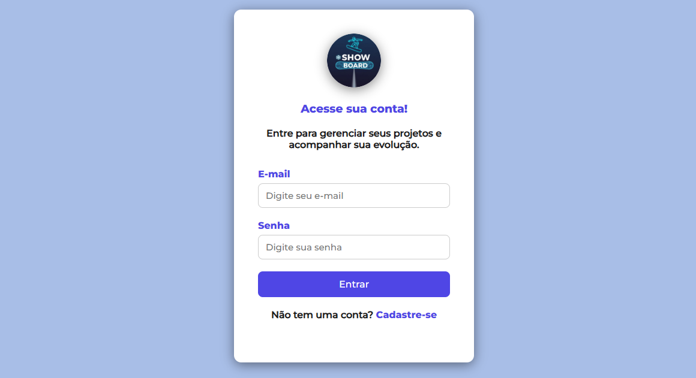

# 🎯 Showboard

## Sistema web responsivo desenvolvido com foco em organização de projetos interativos, aplicando boas práticas de desenvolvimento e trabalho em equipe.

---

  

---

## 📌 Sobre o Projeto

A Showboard foi desenvolvida como projeto acadêmico com o objetivo de aplicar, na prática, conceitos de desenvolvimento web. 

A aplicação permite a organização e visualização de projetos de forma dinâmica, utilizando integração com banco de dados e estrutura baseada em rotas.

Além da parte técnica, o projeto teve como foco a acessibilidade e interface pensada para o usuário, com seu design fluído e focado na boa experiência do usuário.

---

## 🚀 Tecnologias Utilizadas

- **JavaScript** – Interatividade e manipulação do DOM;
- **PHP** – Estrutura de rotas e lógica back-end, fluxos de sessão;
- **Banco de Dados (MySQL)** – Criação, manipulação e organização de dados;
- **HTML5 & CSS3** – Estrutura e estilização responsiva;
- **Git & GitHub** – Versionamento e colaboração;

---

## 👥 Trabalho em Equipe

O projeto foi desenvolvido de forma colaborativa, com divisão clara de responsabilidades entre os integrantes.

Integrantes:
- Wesley Carvalho (Full Stack);
- Henry Gonçalves Furtuna (Back-end);
- Israel Santos (Design/Documentação);
  
---

## ♿ Acessibilidade

O projeto buscou aplicar boas práticas de acessibilidade, com:
- Estrutura semântica em HTML;
- Organização clara de conteúdo;
- Navegação intuitiva;
- Layout responsivo

---

## 📷 Demonstrações

---

---

---

## 📂 Como Executar o Projeto

1. Copie o link completo do repositório no GitHub:
   (https://github.com/wesley1271/Projeto_Showboard.git)

2. Abra o terminal ou Git Bash.

3. Execute o comando:
   git clone (https://github.com/wesley1271/Projeto_Showboard.git)

4. Acesse a pasta do projeto:
   cd projeto_showboard

5. Abra a pasta public no navegador.

---

